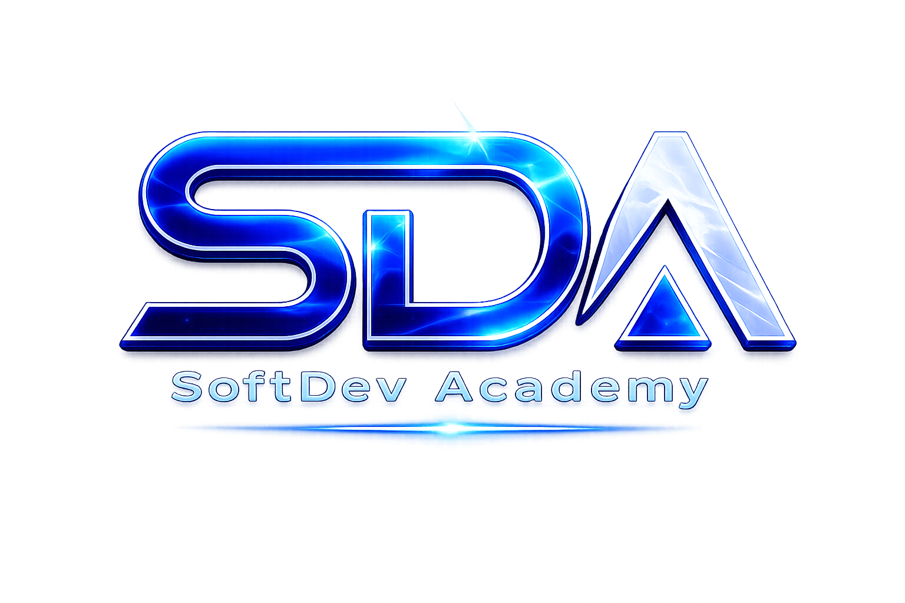

# SoftDevAcademy

### Helping learners develop practical software development skills, create meaningful projects, and build successful careers, freelance businesses, or startups.

---

# About SoftDevAcademy

SoftDevAcademy is a technology education platform focused on practical, project-based learning.

Our mission is to help learners transform knowledge into real-world skills, build professional portfolios, and create successful careers in software development, freelancing, entrepreneurship, and technology.

Whether you are a complete beginner or an experienced developer, our programs are designed to guide you through structured learning paths, hands-on projects, and industry best practices.

---

# Our Learning Philosophy

🚀 Learn → Practice → Build → Deploy → Improve

---

# Core Principles

Everything we build at SoftDevAcademy is guided by a simple set of principles:

* Learn by Doing
* Build Real Projects
* Focus on Practical Skills
* Create Portfolio-Ready Work
* Follow Industry Best Practices
* Continuously Improve
* Think Long-Term

Technology changes, but strong fundamentals, practical experience, and continuous learning remain valuable throughout an entire career.

---

# Learning Paths

🚧 Coming Soon

- Python Developer Career Path
- Java Developer Career Path
- C# Developer Career Path
- Full Stack Web Developer Career Path
- AI & Machine Learning Career Path

---

# Featured Courses

🚧 Coming Soon

---

# Career Paths

🚧 Coming Soon

- Employment
- Freelancing
- Entrepreneurship

---

# Technologies

🚧 Coming Soon

- Python
- Java
- C#
- JavaScript
- HTML
- CSS
- SQL
- AI & Machine Learning

---

# Portfolio Projects

🚧 Coming Soon

---

# Connect With Us

🚧 Coming Soon

---

# Status

Building and continuously improving the SoftDevAcademy ecosystem.

---

# Academy Roadmap

### Current Focus

🔄 Python Developer Career Path

🔄 Portfolio Project Ecosystem

🔄 Learning Resources

### Planned Learning Paths

⏳ Java Developer Career Path

⏳ C# Developer Career Path

⏳ Full Stack Web Developer Career Path

⏳ AI & Machine Learning Career Path

---

# Community

🚧 Coming Soon

SoftDevAcademy is being built around practical learning, project-based education, continuous improvement, and long-term professional growth.

Future community resources may include:

* Learning Resources
* Project Reviews
* Student Showcases
* Career Guidance
* Community Discussions

---

# Resources

🚧 Coming Soon

Future resources may include:

* Learning Guides
* Project Documentation
* Development Tools
* Study Resources
* Career Resources

---

# Vision

Our goal is to create a complete technology learning ecosystem that helps learners move from beginner to professional through structured education, practical projects, portfolio development, and real-world experience.

---

# What Makes Us Different

We believe that learning should go beyond theory.

Our programs are designed to help learners:

* Develop practical skills
* Build meaningful projects
* Create professional portfolios
* Understand real-world workflows
* Prepare for employment opportunities
* Build freelance businesses
* Create technology startups

Every learning path combines education, practice, project development, and long-term career growth.

---

# Project-Based Learning

Practical experience is at the center of every learning path.

Learners are encouraged to:

* Practice continuously
* Build projects regularly
* Apply new concepts immediately
* Improve through iteration
* Develop portfolio-ready solutions

The goal is not only to learn technology, but to use technology to create real solutions.

---

# Long-Term Learning

Technology evolves continuously.

For this reason, SoftDevAcademy promotes a mindset of lifelong learning, continuous improvement, and professional growth.

Learning does not end after completing a course.

It continues through practice, experimentation, project development, and real-world experience.

---

# Future Expansion

The SoftDevAcademy ecosystem will continue to grow through:

* New Learning Paths
* Additional Technologies
* Specialized Courses
* Portfolio Projects
* Learning Resources
* Community Resources
* Career Development Resources

Our objective is to provide learners with a structured and practical roadmap for long-term success in technology.

---

### SoftDevAcademy

Practical Learning • Real Projects • Career Growth

